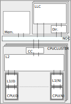

# CC: A Cache Coherency Performance and Validation Model



## Synopsis

Cache coherency protocols are the architectural mechanisms by which
the Single Writer/Multiple Reader (SWMR) invariant in cached,
multiprocessors systems is managed. Although the performance and
functional correctness of such protocols form a central aspect of the
modern-day System-On-Chip (SOC) design, there is often inability to
model either the performance characteristics or validate the
functional correctness of such protocols in the absence of working
RTL. Very often there is insufficient time to fully understand the
minutae of a top-level design before important architectural decisions
or trade-offs must be made. In addition, quite often teams lack
individuals with the cross-disciplined skillset required to accomplish
the task, including: a detailed understanding of computer
architecture, knowledge of software design, hardware design, and
domain knowledge (coherency). Often decisions are made to commit to
some incremental version of a design which has gone before, without
truely understanding the performance and/or functional trade-offs,
which only become known until after a large development committment
has already been made. From the author's own experience, a very large
and well-known semiconductor company (beginning with a Q.) produced an
ARM-based SOC which exhibited a very serious (system halting) protocol
deadlock which was not detected until the near complete RTL had
reached emulation. The project was eventually cancelled and the team
laid-off.

## Discussion

Cache coherency protocols are fundamental to multiprocessor
system-on-chips. Their implmentation is complicated by the following
aspects:

* The state space of a coherency model is very large and there are
  many distinct scenarios to consider when verifying its
  correctness.
* The context of a coherency protocol is system-wide, which
  necessitates either functional RTL of the full system or accurate
  fast behavioral models. Such models are either large and costly to
  simulate, they may arrive only late into the overall development
  process, or in the case of accurate behavorial models, may not
  arrive at all.
* The functional correctness of coherency protocols is incredibly
  important as bugs can result in data corruption (at best) or a
  system hang (at worst) in the case of a protocol deadlock.
* Coherency protocols play a role in the overall performance of a
  multi-processor system as their behavior directly influences the
  ability of CPU to share state between caches and to source state
  through intervention.
* There are many tuneable characteristics of a coherence sub-systems
  that may result in costly and unnecessary performance
  bottlenecks. The number of commands which may be inflight from a CPU
  may affect performance if too small, whereas it may have a negative
  power and area cost if too large. An inefficient directory cache
  layout may necessitate cause unnecessary snoops, or it may cause
  useful state to be evicted from caches because of recalls.

The availability of a software-based performance and verification
model allows for each of these characteristics to be evaluated in the
context of a simplified, but representative, behavioral
simulation. Issues relating to functional correctness or performance
can be analysed and debugged ahead of the final RTL implementation. In
the presence of completed RTL, complex scenarios can be debugged in
the context of a lightweight and fast simulation environment, which is
more efficient than when attempted using a large and unweldy waveform
dump.

A detailed (work in progress) architectural specification of the
performance model can be found at: [Architectural Spec](./doc/ARCH.md)

### Background

This work was originally undertaken during the Covid-19 pandemic and
is intended to demonstrate the author's competency in their areas of
software modelling of computer architecture. An effort such as this is
a large undertaking and is therefore difficult to complete when
working independently and on a part-time basis. Please consider
therefore that the work contained herein may be incomplete and should
not serve the basis as a production quality verification
model.

# Usage:

The project is structured as a normal C++17 project with only very
limited dependencies on outside libraries. SystemC has not been used.

To compile:

``` shell
# Clone and initialize working repository
git clone http://www.github.com/stephenry/cc
pushd cc
git submodule update

# Build project
mkdir build
pushd build
cmake ..
make -j
```

# Unit Tests

For the purpose of development, directed unit tests have been
constructed to verify the functional correctness of certain expected
behaviors of the model. The majority of the emphasis of the work to
date has been carried out using directed tests.

To run, unit tests:

``` shell
ctest .
```

The unit test environment constructs a simulation instance, generates
stimulus, runs the simulation and then checks expected
post-conditions. The test fails if these expected post-conditions have
not been attained. There is limited ability also to perform
self-checking within the simulation, which validates the correctness
of events within the model. There are further plans for randomized
test generation (fuzzers) however the model has not yet reach a point
where this can be carried out.

# Driver:

A relatively simple driver program has been implemented which allows
for the test environment to be configured, and for stimulus to be
defined. A top-level JSON configuration is provided, from which the
top-level simulation environment is defined, constructed and
elaborated. The associated trace-file defines the sequence of
Load/Store commands to be issued by the CPU models in the simulation
and the time at which they are scheduled to occur.

A simple trace driven simulation can be invoked using:

``` shell
./driver/driver ./cfgs/base.trace
```

A full description of the trace-file format can be at:
[TRACE](./doc/STIMULUS.md).

## Example

For the example [JSON configuration](./cfgs/base.json.in), which is a
very simple single CPU system, the following trace causes the CPU 0 to
emit a `LOAD` instruction at time `200` to address `0x1000`, and a
subsequent `LOAD` to the same line at time `400`.

```
// Set paths
M:0,top.cluster.cpu
// Advance cursor to 200
+200
// Issue Load to 0x1000
C:0,LD,0x1000
// Advance cursor to 400
+200
// Issue Load to 0x1000
C:0,LD,0x1000
```

The first `LOAD` instruction causes a compulsary miss in the CPU's L1
cache, which initiates the fill operation. The line is eventually
installed in the cache in the `Exclusive` state, and the `LOAD`
replayed. Sometime later, the second `LOAD` instruction is issued,
hits in the cache and commits immediately (after some small cache
lookup penalty).

The simuation emits a full trace of all messages communicated during
the execution of the stimulus. Upon completion, gathered statistics
are emitted from which it can be seen that one load miss took place
(the initial compulsory miss), followed by two hits corresponding to
the replayed instruction and the second load to the same line.

```
[410.2:FI;top.statistics (M)]:CPU statistics path top.cluster.cpu: '{transaction_count:2}
[410.2:FI;top.statistics (M)]:L1 Cache statistics top.cluster.l1cache: '{store_hit_n:0, store_miss_n:0, load_hit_n:2, load_miss_n:1}
```

The example trace-file can be readily extended as necessary, but as
the simulator remains a work-in-progress, non-trivial sequences are
not yet guarenteed to complete successfully.
